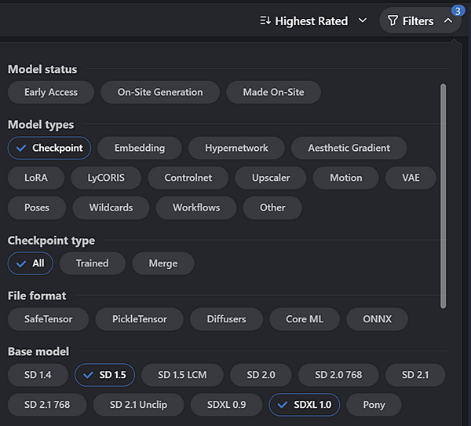
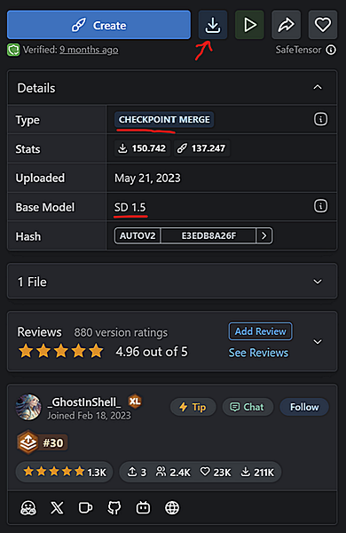
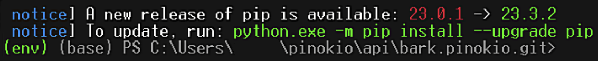
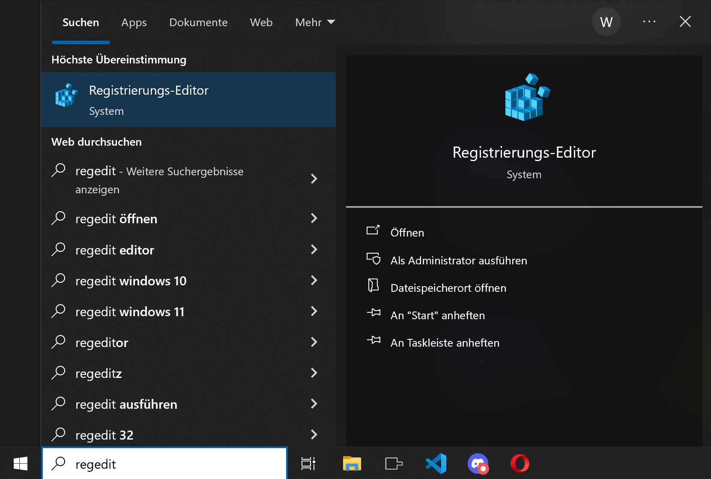

# Pinokio Wiki

- [Pinokio Wiki](#pinokio-wiki)
  - [General](#general)
    - [Install Pinokio](#install-pinokio)
    - [Change the location where Apps are downloaded and installed (Home)](#change-the-location-where-apps-are-downloaded-and-installed-home)
    - [Install Apps with Pinokio](#install-apps-with-pinokio)
    - [Delete installed Apps](#delete-installed-apps)
    - [Upgrade Pinokio](#upgrade-pinokio)
    - [Uninstall Pinokio](#uninstall-pinokio)
    - [Report Bugs](#report-bugs)
  - [Pinokio](#pinokio)
    - [Home Screen](#home-screen)
    - [Settings](#settings)
    - [Discover Page](#discover-page)
    - [Application screen](#application-screen)
      - [Launching the App](#launching-the-app)
      - [Terminal](#terminal)
      - [Wifi Sharing](#wifi-sharing)
      - [Update, Reinstall, Factory Reset and Delete](#update-reinstall-factory-reset-and-delete)
      - [Files](#files)
    - [Model and File Management](#model-and-file-management)
  - [Applications](#applications)
    - [Stable Diffusion Models](#stable-diffusion-models)
    - [Download different models for Stable Diffusion, Fooocus and ComfyUI](#download-different-models-for-stable-diffusion-fooocus-and-comfyui)
    - [Getting started with ComfyUI](#getting-started-with-comfyui)
    - [Loading workflows and installing custom nodes in ComfyUI](#loading-workflows-and-installing-custom-nodes-in-comfyui)
      - [Installation with workflow](#installation-with-workflow)
      - [Installation without workflow](#installation-without-workflow)
  - [FAQ](#faq)
    - [Pinokio is damaged (Mac)](#pinokio-is-damaged-mac)
    - [What does ***"Do NOT use exFAT drives"*** on the Setting page mean?](#what-does-do-not-use-exfat-drives-on-the-setting-page-mean)
    - [I can't change the location of my home directory](#i-cant-change-the-location-of-my-home-directory)
    - [What means ***"ENOENT: no such file or directory"***?](#what-means-enoent-no-such-file-or-directory)
    - [How can I update pip? I'm getting this notification all the time](#how-can-i-update-pip-im-getting-this-notification-all-the-time)
    - [How to apply pip install fixes from GitHub issues in Pinokio (for experienced users only)](#how-to-apply-pip-install-fixes-from-github-issues-in-pinokio-for-experienced-users-only)
      - [How to install a python package with pip on Mac and Linux](#how-to-install-a-python-package-with-pip-on-mac-and-linux)
      - [How to install a python package with pip on Windows](#how-to-install-a-python-package-with-pip-on-windows)
  - [Troubleshooting - Pinokio](#troubleshooting---pinokio)
    - [White screen when visiting the Discover Page](#white-screen-when-visiting-the-discover-page)
    - [White screen when downloading an Application](#white-screen-when-downloading-an-application)
    - [git, zip, conda: node.js can't be installed](#git-zip-conda-nodejs-cant-be-installed)
    - [Conda: ffmpeg, cmake can't be installed](#conda-ffmpeg-cmake-cant-be-installed)
    - [Visual Buildtools fails to install on Windows](#visual-buildtools-fails-to-install-on-windows)
    - [*Context:68:3 Error*](#context683-error)
      - [1.) Uninstall Visual Studio](#1-uninstall-visual-studio)
      - [2.) Manually add Visual Buildtools 2019 to your existing Visual Studios version](#2-manually-add-visual-buildtools-2019-to-your-existing-visual-studios-version)
      - [3.) Manually install Visual Buildtools 2019 with Visual Studio](#3-manually-install-visual-buildtools-2019-with-visual-studio)
      - [4.) Manually install Visual Buildtools 2019 with Windows Powershell](#4-manually-install-visual-buildtools-2019-with-windows-powershell)
    - [*Node:fs:207:21 Error*](#nodefs20721-error)
    - [Registry can't be "installed"](#registry-cant-be-installed)
    - [Cuda can't be installed](#cuda-cant-be-installed)
  - [Troubleshooting - Applications](#troubleshooting---applications)
    - [Module Not Found Error](#module-not-found-error)
    - [Facefusion doesn't launch after update](#facefusion-doesnt-launch-after-update)
    - [Facefusion launches - no video output](#facefusion-launches---no-video-output)
  - [Requirements (not verified)](#requirements-not-verified)
    - [Stable Diffusion](#stable-diffusion)
    - [Fooocus](#fooocus)
    - [ComfyUI](#comfyui)
    - [Gligen](#gligen)
    - [Supir](#supir)
    - [TripoSR](#triposr)
    - [InstantID](#instantid)
    - [IP-Adapter-FaceID](#ip-adapter-faceid)
    - [Video2Densepose](#video2densepose)
    - [Turbo SDXL](#turbo-sdxl)
    - [Stable Cascade](#stable-cascade)
    - [BBRIA RMBG - Background Remover](#bbria-rmbg---background-remover)
    - [Differential Diffusion](#differential-diffusion)
    - [LGM](#lgm)
    - [XTTS](#xtts)
    - [Audio Gradio](#audio-gradio)
    - [Magic Animate Mini](#magic-animate-mini)
    - [Moore-AnimateAnyone / Moore-AnimateAnyone-Mini](#moore-animateanyone--moore-animateanyone-mini)

## General

### Install Pinokio

- Please follow the instructions in [Pinokio Tutorial](https://program.pinokio.computer/#/?id=install) to install Pinokio for [Windows](https://program.pinokio.computer/#/?id=windows), [Mac](https://program.pinokio.computer/#/?id=mac) or [Linux](https://program.pinokio.computer/#/?id=linux).

> **Note:** Currently, **Pinokio is not supported on Win 11 Canary and Win 11 Dev build** since it causes a white screen when downloading Apps from the Discover Page or crashes Pinokio when trying to install the requirements.  
> This crash is caused by ntdll.dll, a core Windows library. Despite numerous attempts to find a workaround for this problem, there is nothing that can be done. The only way to use Pinokio is to revert to a stable Windows 11 build.

### Change the location where Apps are downloaded and installed (Home)

The Home Directory is the place where all your Apps and needed components will be installed.  
The location of the Home Directory can be changed in Pinokio - Settings (The wheel in the top right corner on the Pinokio main page).

- The path to the new location may not contain spaces, special characters or non-Unicode letters. Underscores, dashes and numbers are allowed.
- The drive hosting your new Home Directory must be formatted with the NTFS file system.
- The new Home Directory folder must have read and write permissions for all users.
- The location of your new home may not yet exist.
- It's recommended to name your Home Directory Pinokio (e.g.: `C:\AI\pinokio`)
- The drive needs to have enough space. *Apps, models and components can have a size up to 100GB. (For most Apps a min. size of 50GB should be enough)*

Once you've set your new location, click the *Save* button and wait until Pinokio has finished to move your files to the new location.  
Depending on the amount of files this may take some time.  
**Don't abort** this process or turn off your computer until it has fully completed or Pinokio might not start properly next time.

### Install Apps with Pinokio

Visit the Discover page in Pinokio to install new Apps.  
Click on the Icon of the App you want to Install and click the Download button.  
Choose the default folder or set a new name for the App folder and click Download.
Once downloaded, the App appears on the main page of Pinokio.
Select the App and click ***Install***.

### Delete installed Apps

The `api`  folder contains all your installed Apps. Just delete the according App.Pinokio.git folder in your explorer.  
To delete an App simply go to `.\pinokio\api` If you don't know where to find this folder, just have a look at Pinokio - Settings (The wheel in the top right corner on the Pinokio main page).  
Navigate there with your Explorer or File Manager and in there you will see the `api` folder.

### Upgrade Pinokio

- Close Pinokio if it is still open.
- Visit the [Pinokio Tutorial](https://program.pinokio.computer/#/?id=install), select the link for your OS and press the ***Download*** button.
- Download and install Pinokio. This will replace your old Pinokio version with the new one without touching your installed Apps.

> **Note:** Sometimes it is necessary to reset the `bin` folder (via Settings in Pinokio). This is a common fix for many other problems as well. As it flushes out any problematic packages that may be causing issues. It's generally recommended as the first fix for most problems. It won't affect the settings or saved files of any of your currently installed applications, but it will download and reinstall all necessary requirements again the first time you run an Application afterwards.

### Uninstall Pinokio

You can uninstall Pinokio like any other program on your system.  
There is also an Uninstall Pinokio file in the same folder like the Pinokio program.  
On Windows it is located in: `C:\Users\<user>\AppData\Local\Programs\Pinokio`  
On a Mac it is in: `~% /Applications/`  
This will only uninstall Pinokio ***not*** your Apps. Your Home directory will stay ***untouched***.  

**To remove Pinokio and all its components completely from your system, you also need to:**

- delete the `pinokio` folder of your home directory (you find its location in Pinokio - Settings)
- delete the `pinokio` folder containing the configuration files
  - On Windows: `C:\Users\<user>\AppData\Roaming\Pinokio`
  - On Macs: `~% /Users/<user>/Library/Application Support/Pinokio`

### Report Bugs

If you find a bug, if something doesn't work as expected, or if you're having trouble running an Application, please visit the [Pinokio Discord Server][Disc] and post your issue in one of the #support channels.

- Describe your issue in [pinokio-support][pisu] and post a screenshot if possible (the quickest way to get help).
- Or hit the ***Report Bug button*** at the top right corner on the main page of Pinokio and post your logs in the [forum][foru] and describe the bug or issue.
- You can also [create a ticket][tick]. Tickets and the information they contain can only be viewed by admins.  
  After creating a ticket, please provide as much information as possible to get quick help.  
  Such as:
  - A brief description of your issue or error
  - OS and GPU
  - **Most important**: Your Logs `logs.zip` (Logs will be generated when you hit the report bug button and can be saved anywhere on your computer)
  - Screenshots of the issue or error (if relevant)
- Advice on how to use Applications, can be found in [app-assistance][apas].

> **Note:** The channel links provided above will only work if you have joined the [Pinokio Discord Server][Disc] in the first place.

| [Top](#pinokio-wiki) | [General](#general) | [Applications](#applications) | [FAQ](#faq) | [Troubleshooting - Pinokio](#troubleshooting---pinokio) | [Troubleshooting - Applications](#troubleshooting---applications) | [Requirements](#requirements-not-verified) |

---

## Pinokio

### Home Screen

The Home screen of Pinokio is divided in 2 sections.  

- **Not Running** lists all downloaded and Installed Apps in Pinokio.  
- **Running** lists all Apps launched with their according Start / Launch button.

Currently running Apps are displayed with a green frame and a spinning circle at the top of the Home screen.  
*Although it is **technically possible** to run more than one Application at the same time, it **isn't recommended** since most of the Apps have a significant performance consumption.*

### Settings

The settings page displays the currently installed Pinokio version and can be reached by clicking the wheel at the top right corner of the home screen.
Here you can:

- Change the color theme
- [Change the location of your Home directory](#change-the-location-where-apps-are-downloaded-and-installed-home)
- Troubleshoot (Pinokio 1.2.0 an higher)
  - View or delete the `bin` folder (deleting will remove all pre-requirements. They will be reinstalled with the next Application you install)
  - View or delete the `cache` folder (deleting will remove all temporary files and some default models. These models will be reloaded the next time the App that needs the model is launched)
  - View the `drive` folder (this is the location of files shared by Pinokio Applications to reduce disk space, such as python packages of the different environments and custom models, Loras, Upscaler and controlnet models used by Stable Diffusion based Apps)

### Discover Page

The Discover page in Pinokio allows you to install new Apps.

- Click on an App's icon to view more details, then click the Download button.
- In the following window, choose a folder name and click **Download** to download the App with Pinokio.

All downloaded Apps will be displayed on the Pinokio home screen and can be installed from there.

> - Applications labeled with **SCRIPT VERSION 1** only work with **Pinokio 1.0.15** or higher!
> - Applications labeled with **SCRIPT VERSION 1.5** only work with **Pinokio 1.3.4** or higher!  
> - A yellow banner with a corresponding message appears on the main page of Pinokio if your Pinokio version doesn't support the Script Version of an installed Application.
> In that case please [Upgrade Pinokio](#upgrade-pinokio) to the latest version.

All requirements will be installed with your first App.

> **Note: It is highly recommended to switch off your antivirus, during this first installation to avoid unnecessary subsequent troubleshooting.**

Applications not created by verified publishers and not tagged as ***Pinokio*** on GitHub don't appear on the Discover page. They can still be installed with the ***Download from URL*** button at the top of the Discover page.
> **Note:** Only Applications with a `pinokio.js` and respective `install.json` or `install.js` and `start.json` or `start.js` scripts can be installed with Pinokio.  
To find out if an Application on GitHub that doesn't appear on the Discover page can be installed with Pinokio, have a look on the GitHub repo and check for these scripts on the main page of the project.  

### Application screen

Click an App on the Pinokio Home screen to see the Application screen

#### Launching the App

To start the Application, click the *Start* / *Launch* button and wait until it is fully launched.  
Once launched, an **Open WebUI** or **Open Session** button will appear to use the App inside of Pinokio.  
To use the Application in your default browser, click the **Open External** button above the user interface.

#### Terminal

The Terminal / Server displays all processes, errors and details about the App.  
Here you can also stop and restart the App again by clicking the **Stop** / **Run** button on the top.

#### Wifi Sharing

Applications with Script version 1.1 and higher now support Wifi Sharing and can be accessed via mobile phone or other devices within the local network.
To access Pinokio and these Applications via Wifi, it is needed to grant access for the device in the first place.  
This can be done by clicking Wifi sharing on the main page of Pinokio at the top right corner and scanning the given QR Code.
For LAN connections within the local network, this step can be skipped.  

- ***Wifi sharing*** will open the public URL to remote control the App with your mobile phone or tablet.
- ***Open Session*** opens the App only with the local URL.
- Additionally to the local URL address a proxy address appears in the terminal to access the App within the local network.

#### Update, Reinstall, Factory Reset and Delete

- To update an App, close it if running and click the **Update** button. *This will update the App to the latest version.*  
- To reinstall an App, close it if running and click **Reinstall**. *This will reinstall the App without deleting any data or creations.*  
- A **Factory Reset** will delete the App but not the Pinokio scripts. *It will still be displayed on the Pinokio home screen and can be reinstalled any time.*  
Not all Apps come with an Update, Reinstall or Factory Reset button
- To delete an App, close it if running and click **Delete**. A window appears asking if you are really sure to delete the App and all its content. *This will delete the App completely and it will not be displayed on the Pinokio home screen anymore.*

#### Files

The Files button leads to the Pinokio scripts, App-folder, subfolders and all containing files. It is even possible to edit and save these files within Pinokio, although it is recommended to use an appropriate Editor or IDE for that purpose.  
This should only be done in exceptional cases and with caution since a mistake can easily break the App.  
*It's always wise to make a backup of the original files before modifying them.*
> **Note: *A Factory Reset will delete all files and folders* in the App folder *including your output and custom models! Always* make sure to *save all important files and models beforehand*!**

### Model and File Management

- Pinokio will be installed in
  - `C:\Users\<user>\AppData\Programs\Pinokio` on Windows  
  - `~% / Applications/` on Mac
- Applications will be installed in `.\pinokio\api`
  - Each App has their very own Outputs and models folder.
    - Output folder contains all generated files
    - Models are stored in the Models / Checkpoints folder  

>**Note:** If you delete an Application or click the ***Factory Reset*** Button, the Output and Models folder will be deleted as well.  
**Make sure to save any important *Output Files* and *Models* before you delete an App!**

- The **bin** folder `.\pinokio\bin` contains all required components for Applications. These *pre-requirements* (Conda, git, zip, etc.) will be installed in `.\pinokio\bin\miniconda`
- The **Logs** folder `.\pinokio\logs` stores all installation logs, launch protocols and system information needed to troubleshoot issues.  
  This folder will be automatically zipped when you hit the ***Report Bug button***.
- Temporary files are stored in the **Cache** folder `.pinokio\Cache` e.g. *Pip_Cache* for components, *Temp* and *Gradio_Temp* for intermediate output files.  
An exception is *HF_Home* and *XDG_DATA_HOME*. Some Apps download their default models in there when they launch the first time.
*Principally it is possible to delete all files in the Cache folders, these files will be automatically downloaded if they are needed again.*

> **Note:** Some of these files, especially models, can be very large and should be kept to save time.

- The **drive** folder `.\pinokio\dirve` is a shared models folder used by Stable Diffusion based Applications to save drive space.
  Models, Loras, Embeddings and many more downloaded and stored in their according folders in `.\pinokio\drive\drives\peers\d1704581225212\` can be used by Automatic1111, Fooocus, and ComfyUI without moving or copying the models.

| [Top](#pinokio-wiki) | [General](#general) | [Pinokio](#pinokio) | [FAQ](#faq) | [Troubleshooting - Pinokio](#troubleshooting---pinokio) | [Troubleshooting - Applications](#troubleshooting---applications) | [Requirements](#requirements-not-verified) |

---

## Applications

### Stable Diffusion Models

### Download different models for Stable Diffusion, Fooocus and ComfyUI

On [Civitai](https://civitai.com) you can download finetuned SD1.5 and SDXL models, Loras and more for free.
But it's recommended to create a free account to see all available models.  
***The new Stable Diffusion based **version 1.1** Apps come with a button allowing you to access Civitai directly within the App.***  

- Filter the models displayed in the top right corner of the [Models](https://civitai.com/models) page.
- To display only models, filter for *Checkpoints*, *All* and your desired model version *SDXL or SD1.5*  (pic1)
  - Select SD1.5 if you have less than 8GB VRAM
  - Select SD1.5 and SDXL if you have 8GB and more VRAM
- Select an image that represents best what you have in mind and click on it.
- On the following page you can scroll through different pictures created with that model.
Above these images you see different versions of this model. Most likely the latest version is the newest and best one.
- The right side displays the model type and the Stable Diffusion version. Choose your desired model version at the top and press the *Download* Button right beside the *Create* Button to download the model. (pic2)
- Put it into `.\pinokio\drive\drives\peers\d1704581225212\checkpoints` on your computer.

1.) Filters  


2.) Download  


Back in Stable Diffusion WebUI click the blue refresh button at the top left corner right beside the *models dropdown menu*.  
After that you can select your model in that dropdown menu. (pic3)  
Lower the size of the images you want to create to 512 x 512 up to 800 x 800 pixel for SD1.5 models since they are trained on 512px images. Sizes bigger than 800px would lead to errors, mutations, mirror effects or double objects. Common horizontal and vertical formats like 600 x 800 or 768 x 512 work as well.  
SDXL models can be used with sizes up to 1280x1280px.

3.) Refresh and select  


---

### Getting started with ComfyUI

ComfyUI is perhaps the most complex, but also the most versatile local image and video generation App available.
You can do anything with it, but you need to know what you are doing!  
There are great workflows on the internet that can be used without connecting any nodes by yourself. But none of them work "out of the box" and deliver  the desired output without tweaking the settings in those nodes.
In addition it is necessary to download and select the correct models in the corresponding model loader nodes, otherwise errors are inevitable.  
To save yourself a lot of time jumping from one error message to the next, it's highly recommended to start at the beginning and **learn some basics**.

A good way to start are these YouTube tutorials. If you watch the first videos in the right order, you'll quickly get a basic understanding of how ComfyUI works and also how to understand, fix and prevent any errors.
> **Note: ALWAYS** install custom nodes with the **ComfyUI Manager**, even if a video shows you how to clone the nodes into ComfyUI.
The Manager is the **easiest** and **safest way** to install, uninstall and organize your nodes. It is pre-installed in your ComfyUI.  
How to [install custom nodes](#loading-workflows-and-installing-custom-nodes-in-comfyui) using the Manager is described later in this Wiki.

From beginner to expert. German tutorial with English subs. Best place to start, especially if ComfyUI is your first image generation App.  
[ComfyUI Tutorial - A Latent Place](https://youtu.be/HOIeLNNhdaU?si=Imvo35ZOo0dim6K3&t=628)

English tutorial playlist with 8 videos. From beginner to advanced.  
[Learn ComfyUI - Olivio Sarikas](https://youtu.be/LNOlk8oz1nY?si=cT2wb740Xpglf15e&t=343)

ComfyUI Guides - Workflow, node explanation, example workflows and shortcuts  
[Beginner's Guide to ComfyUI - Stable Diffusion Art](https://stable-diffusion-art.com/comfyui/)  
[ComfUI Examples](https://comfyanonymous.github.io/ComfyUI_examples/)  
[ComfyUI Shortcuts](https://blenderneko.github.io/ComfyUI-docs/Interface/Shortcuts/)

---

### Loading workflows and installing custom nodes in ComfyUI

#### Installation with workflow

There are 2 ways to load and use new workflows in ComfyUI:

- Drag and drop the workflow stored on your computer into ComfyUI
- Click ***Load*** in ComfyUI and select the workflow you want to use

All nodes and their connections to each other will be displayed in ComfyUI.  
Nodes that are required but not yet installed will be displayed in red and a message will appear informing you that they are missing.

- Click on ***Manager*** in ComfyUI
- Click ***Install missing custom nodes***
- Install one node at a time. Once a node is installed, a message will appear at the bottom of the list.
- When all nodes are installed, click the ***Terminal*** on the left side menu of ComfyUI in Pinokio.
  *The Restart button in ComfyUI doesn't work!*
- Stop ComfyUI with the ***Stop*** button at the top of the Terminal
- Click ***Run*** to restart ComfyUI (same button)
  The necessary requirements for the nodes will now be installed.
- In ComfyUI click the Refresh button on top of the user interface to display the installed nodes

> **Note:** Workflows often require specific models to be downloaded into the appropriate folders.  
> Read the workflow description carefully and download these models to the correct folders.  
> Some models can also be downloaded using the Manager (***Install Models***).  
> The manager will download them directly to the correct folders.  
> After downloading a model it is necessary to click the ***Refresh*** button of ComfyUI (below the ***Load*** button)

#### Installation without workflow

Also custom nodes without workflow can be installed with the Manager

- Click on ***Manager*** in ComfyUI
- Click ***Install custom nodes***
- Type the name of the node you want to install in the search field at the top right corner of the node list and press Enter.
- Make sure that the correct custom nodes are displayed and click ***Install***.  
  When the installation is complete, a message appears at the bottom of the list.
  *The Restart button in ComfyUI doesn't work!*
- Click the ***Terminal*** on the left side menu of ComfyUI in Pinokio.
- Stop ComfyUI with the ***Stop*** button at the top of the Terminal
- Click ***Run*** to restart ComfyUI (same button)  
  The necessary requirements for the node will now be installed.
- In ComfyUI click the Refresh button on top of the user interface to display the installed nodes

> **Note:** Custom nodes sometimes require specific models to be downloaded into the appropriate folders.  
> Read the workflow description carefully and download these models to the correct folders.  
> Some models can also be downloaded using the Manager (***Install Models***).  
> The manager will download them directly to the correct folders.  
> After downloading a model it is necessary to click the ***Refresh*** button of ComfyUI (below the ***Load*** button)

1.) Load workflow  


2.) Select workflow  


3.) Missing nodes  


4.) Click Manager  


5.) Click Install Missing Custom Nodes  


6.) Install nodes  


7.) Stop ComfyUI  


8.) Installation of the requirements at start  


9.) Refresh user interface  


| [Top](#pinokio-wiki) | [General](#general) | [Pinokio](#pinokio) | [Applications](#applications) | [Troubleshooting - Pinokio](#troubleshooting---pinokio) | [Troubleshooting - Applications](#troubleshooting---applications) | [Requirements](#requirements-not-verified) |

---

## FAQ

### Pinokio is damaged (Mac)

Please follow the steps in the [Pinokio tutorial](https://program.pinokio.computer/#/?id=mac) to install Pinokio on your Mac.

- Drag the Pinokio App into the Application folder
- Open the file `patch.command`
- Enter your password
  > This step is crucial to tell your Mac to grant permission for Pinokio.  
  > Entering your password is invisible. Just type your password and press Enter.
- Now you can start Pinokio in your Applications folder

---

### What does ***"Do NOT use exFAT drives"*** on the Setting page mean?

> *Do NOT use exFAT drives


Actually, this is more of a notification than a warning. If your home directory is in the default location on your C drive or any other built-in SSD drive, it is expected to be formatted with the NTFS file system. exFAT is an old filesystem from the Win98 era and is only used for external drives today.  
However, if you decide to change the location of your home directory, you should first check the filesystem on the intended drive because exFAT is a limited filesystem that doesn't support all the features provided by Pinokio and its applications.

To check the file system of a drive, open your Explorer, right-click on the drive letter and select ***Properties***.

 

---

### I can't change the location of my home directory

> Error: The path already exists. Please remove the folder and retry.


This error message occurs if the folder you are trying to change your home directory to still exists.  
If you set a new path in Pinokio Settings, Pinokio will create this new folder for you. But this is only possible as long as this folder doesn't exist. Otherwise the folder and all its content will be overwritten. To avoid this, you see this error message.  
To fix this problem, you need to delete or rename the folder you want to change your home directory to.  
For example: If you set the location to `D:\AI\pinokio`, then this `pinokio` folder may not exist yet. It will be automatically created by Pinokio when you set this path in Pinokio Settings and will become your new home folder.  
For further information please read how to ***[Change the location where Apps are downloaded and installed (Home)](#change-the-location-where-apps-are-downloaded-and-installed-home)***

---

### What means ***"ENOENT: no such file or directory"***?

This kind of error occurs when a file, module or any component needed for the App is missing.  
To find out which component is missing, have a look at the Terminal / Server or restart the App.
The last lines of the messages in the Terminal when the App has launched reveal the real problem.  
Common issues are, *"Module Not Found Error: No module named..."* or *"Out Of Memory Error"*.  

- Missing modules can often be fixed by reinstalling the App.  
- Out of Memory Errors can be fixed by
  - decreasing the size of an image
  - decreasing the number of images you created simultaneously
  - or using a [smaller model](#download-different-models-for-stable-diffusion-fooocus-and-comfyui) (in some Stable Diffusion based Apps).
  > In other cases, there is no way to reduce memory consumption, which means that this particular Application cannot be used with the current hardware.

If reinstalling the App in case of a missing module doesn't help, or if you are unsure about the cause, please make a screenshot of the error in the Terminal / Server and post it in [pinokio-support][pisu] or hit the ***Report Bug button*** and post your logs.zip along with a screenshot of the error in the Terminal and a short description of the problem in the [forum][foru].

---

### How can I update pip? I'm getting this notification all the time

> A new release of pip is available



This message can be ignored. It is just information that a newer pip version is available.  
In fact, all applications come with this message. Even if they are installed manually.  
If there is an error, your *pip version* is *never the reason* and *upgrading pip* is *never a solution*.

---

### How to apply pip install fixes from GitHub issues in Pinokio (for experienced users only)

Each Application in pinokio is installed in its own environment along with its own set of requirements.
This ensures that applications don't affect each other and avoids python package conflicts.  
If you want to install a certain package or another version of an existing package for an Application, it is crucial to activate the respective environment of that App in the first place or the package will be installed into the base environment. (Installing packages in the base environment will not have the desired effect, but it can mess up the base environment and cause problems.)

>**Note: To install a python package into the respective Application environment you need to determine the location of the App and activate the environment.**

On the Settings page of Pinokio you see the path to the `pinokio` folder of your Home Directory. (Pic 1)  
Applications are installed in `.\pinokio\api`  
You can look up the path to your Application in your Explorer or Finder (Pic 2)  
All newer applications have a fairly similar folder structure.  
You will find the App in `.\pinokio\api<application>.git\app`  
On Windows the activation file is located in `.\pinokio\api\<application>.git\app\env\Scripts`  
On Mac and Linux the activation file is located in `./pinokio/api/<application>.git/app/env/bin`  
***There are some exceptions like Automatic1111 and Forge e.g. The environment of these apps is called `venv`***

On Windows you need Anaconda Powershell Prompt (miniconda) to install a python package.  
On Mac and Linux you can use your Terminal.

#### How to install a python package with pip on Mac and Linux

- Close Pinokio
- Open your Terminal
- Navigate to the application for which you want to install the package. `cd ./pinokio/api/<application>.git/app`  
  (replace `<application>` with the name of the Application you want to navigate to)
- Activate the environment of this Application. `source env/bin/activate`
- Now you should see an **(env)** in front of your prompt. **Don't proceed from here if it is missing!**
- After the environment is activated successfully, you can install your python package. `pip install <package>`
- To install a specific version of a package, the command would be `pip install <package>==<version number>`  
  (replace `<package>` with the package name and `<version number>` with the version number of the package you want to install)
- If asked, confirm with `y`
- A message appears indicating that the package was successfully installed.
- Optional:
  - To verify the installation you can use the command `pip show <package>`  
    (replace `<package>` with the name of the package you want to install)
  - `pip list` lists all packages installed in this specific environment with their corresponding version.

**Example:**
Lets say your home directory is `/Users/Michael/pinokio` and you want to install `onnxruntime-gpu` in **ComfyUI**.  
Then it would work like this:

- Close Pinokio
- Open your Terminal
- Navigate to ComfyUI `cd /Users/Michael/pinokio/api/comfyui.git/app`
- Activate the environment `source env/bin/activate`
- Install onnxruntime-gpu `pip install onnxruntime-gpu`
- If you wanted to install onnxruntime-gpu 1.17.0 the command would be `pip install onnxruntime-gpu==1.17.0`
- A message appears indicating that the package was successfully installed.
- Optional:
  - To verify the installation you can use the command `pip show onnxruntime-gpu`
  - `pip list` lists all packages installed in the ComfyUI environment with their corresponding version.

#### How to install a python package with pip on Windows

- Close Pinokio
- Open Anaconda Powershell Prompt (Type "Anaconda Powershell" into your Taskbar search field and open it)
- Navigate to the application for which you want to install the package. `cd .\pinokio\api\<application>.git\app`  
  (replace `<application>` with the name of the Application you want to navigate to)
- Activate the environment of this Application. `env\Scripts\activate`
- Now you should see a **green (env)** in front of your prompt. **Don't proceed from here if it is missing!**
- After the environment is activated successfully, you can install your python package. `pip install <package>`
- To install a specific version of a package, the command would be `pip install <package>==<version number>`  
  (replace `<package>` with the package name and `<version number>` with the version number of the package you want to install)
- If asked, confirm with `y`
- A message appears indicating that the package was successfully installed.
- Optional:
  - To verify the installation you can use the command `pip show <package>`  
    (replace `<package>` with the name of the package you want to install)
  - `pip list` lists all packages installed in the ComfyUI environment with their corresponding version.

**Example:**
Lets say your home directory is `D:\pinokio` and you want to install `onnxruntime-gpu` in **ComfyUI**.  
Then it would work like this:

- Close Pinokio
- Open Anaconda Powershell  (Pic 3)
- Navigate to ComfyUI `cd D:\pinokio\api\comfyui.git\app` (Pic 4)
- Activate the environment `env\Scripts\activate` (Pic 5)
  - A green (env) is displayed in front of your prompt. - **Don't proceed if this (env) is missing!**
  - If the (env) is white, you are using Anaconda Prompt. Repeat the steps using Anaconda Powershell.
- Install onnxruntime-gpu `pip install onnxruntime-gpu` (Pic 6)
- If you wanted to install onnxruntime-gpu 1.17.0 the command would be `pip install onnxruntime-gpu==1.17.0` (Pic 7)
- A message appears indicating that the package was successfully installed. (Pic 8)
- Optional:
  - To verify the installation you can use the command `pip show onnxruntime-gpu` (Pic 9)
  - `pip list` lists all packages installed in the ComfyUI environment with their corresponding version. (Pic 10)

1.) Look up the path to your Home Directory on the Settings page  


2.) Look up the path to your Application in your Explorer or Finder  


3.) Search for Anaconda Powershell and open it  


4.) Navigate to ComfyUI  


5.) Activate the environment  


6.) Install onnxruntime-gpu  


7.) Or install a specific version  


8.) Successful Installation  


9.) Verify installation  


10.) List packages  


| [Top](#pinokio-wiki) | [General](#general) | [Pinokio](#pinokio) | [Applications](#applications) | [FAQ](#faq) | [Troubleshooting - Applications](#troubleshooting---applications) | [Requirements](#requirements-not-verified) |

---

## Troubleshooting - Pinokio

### White screen when visiting the Discover Page

Visiting the Discover page to download Applications is the only option that requires an Internet connection.  
In some cases, an antivirus program, VPN, proxy, or firewall restrictions on a corporate network may block this connection.  

- Please disable all of these or contact your supervisor.
- Restart Pinokio
- Find the culprit and whitelist Pinokio or disable the responsible service while visiting the Discover Page

### White screen when downloading an Application

If you can visit the Discover Page, but get a white screen when you try to download an Application, then you are probably using Windows 11 Canary or a Windows 11 Dev build. Both versions are known to crash Pinokio or make it impossible to download Applications from the Discover Page. The only workaround is to revert to a stable Windows 11 build.

### git, zip, conda: node.js can't be installed


There are basically 2 reasons why you might end up in this kind of installation loop.

- Either an antivirus or your firewall is blocking the installation of needed components  
- Or Pinokio detects a pre-installed Anaconda version and skips the installation of the needed components

  - If there is a pre-installed Anaconda version you don't need, please uninstall it.
  - If you need your pre-installed Anaconda version please remove it from PATH temporarily until all requirements are installed.
  - Deactivate your antivirus program and firewall.
  - Delete the `bin` folder `.\pinokio\bin`
  - Try to install the App again

Pinokio will now install Miniconda and the other components again properly.

---

### Conda: ffmpeg, cmake can't be installed


A similar loop can occur during the installation of conda:ffmpeg, cmake on Mac, Linux, and sometimes even on Windows.  
Most likely this fails with the message: *"CondaValueError: You have chosen a non-default solver backend (libmamba) but it was not recognized. Choose one of: classic"*


This loop can be often seen after updating pinokio from an earlier version.  
In previous versions libmamba was installed in another channel.
To solve this issue, it's needed to install the Requirements again.

- Delete the `bin` folder `.\pinokio\bin`
- Try to install the App again

---

### Visual Buildtools fails to install on Windows

### *Context:68:3 Error*

   
If Visual Buildtools fails with the **context:68:3** error, it often happens due to a partially preinstalled version or not enough disk space on your system drive.
There are 3 ways to fix this:

> Make sure you have at least 15 GB space on your system drive

#### 1.) Uninstall Visual Studio

> *This should only be done if Visual Studio isn't needed by any other program on your computer*

- a.) Start the Visual Studio Installer (You find it by typing "Visual" in the search field of your Windows taskbar)
- b.) Once opened, uninstall **all** old Visual Studio versions.
- c.) Once finished, close the installer
- d.) Run Pinokio and install your App again
  
1.) a.) Visual Studio Installer  
  

1.) b.) Uninstall old versions  
  

---

#### 2.) Manually add Visual Buildtools 2019 to your existing Visual Studios version

- a.) Start the Visual Studio Installer - *Screenshot 1.) a.)*
- b.) Click "Modify"
- c.) Select "Desktop Development C++" and check the following components like marked in *Screenshot 2.) c.)*
  - C++ Build Tools core features
  - C++ 2019 Redistributable Update
  - C++ core desktop features
  - MSVC v142 - VS 2019 C++ x64/x86 build tools
  - Windows 10 SDK (10.0.19041.0)
  - C++ CMake tools for Windows
  - Testing tools core features - Build Tools
  - C++ AddressSanitizer
- d.) Click the "Modify" button at the bottom right corner to install the Visual Buildtools

2.) b.) Modify your Visual Studio installation  


2.) c.) Desktop Development C++ and Components  


---

#### 3.) Manually install Visual Buildtools 2019 with Visual Studio

- a.) Start the Visual Studio Installer - *Screenshot 1.) a.)*
- b.) Click the "Available" tab and choose "Visual Studio Community 2022" and click "Install"
- c.) Select "Desktop Development C++" and check the following components like marked in *Screenshot 2.) c.)*
  - C++ Build Tools core features
  - C++ 2019 Redistributable Update
  - C++ core desktop features
  - MSVC v142 - VS 2019 C++ x64/x86 build tools
  - Windows 10 SDK (10.0.19041.0)
  - C++ CMake tools for Windows
  - Testing tools core features - Build Tools
  - C++ AddressSanitizer
- d.) Click the "Install" button at the bottom right corner to install the Visual Buildtools

3.) b.) Available Tab

---

#### 4.) Manually install Visual Buildtools 2019 with Windows Powershell

- a.) Look up the path to your Home Directory on the Settings page of Pinokio
- b.) Open Windows Powershell as Administrator (right click the windows button on your taskbar and select it)
- c.) Navigate to `.\pinokio\bin` - Type `cd <path to your home directory>\bin`  
  (replace `<path to your home directory>` with the path you see on the Settings page)
  - >Let's say the path to your Home Directory is `D:\pinokio`, the command would be `cd D:\pinokio\bin`
- d.) Copy / paste the command below into Windows Powershell (**CTRL + C** or copy button to copy,  **CTR + V** to paste)

```bin
.\vs_buildtools.exe --passive --wait --includeRecommended --nocache --add Microsoft.VisualStudio.Workload.VCTools
```

- e.) The Visual Installer should now launch and install Visual Buildtools 2019 on your system drive.

4.) a.) Look up your Home Directory  


4.) b.) Open Windows Powershell as Administrator  


4.) c.) Navigate to the `bin` folder  


4.) d.) Copy / Paste the command to install vs buildtools into the Powershell  


4.) e.) Installation of visual buildtools 2019  


---

### *Node:fs:207:21 Error*


Visual buildtools fails due to the **node:fs:207:21** error, if a folder name in the path to your home directory contains a space, special characters or non-Unicode letters.  
In this case please [change the path to your Pinokio home directory](#change-the-location-where-apps-are-downloaded-and-installed-home).

---

### Registry can't be "installed"

It's rather "editing" the registry than an installation.  
By default on Windows you can't access a path that is longer than 260 characters, which is necessary for several App installations.
That's why Pinokio enables LONG PATHS on Windows. If it fails, it can be done manually.  
Therefore you need to:

- Open the registry (Type "regedit" in the search field of your taskbar and select it)
- A popup window from Windows appears asking for permission. Click ***OK***
- Copy / Paste the path below into the address field at the top of the registry and press ***Enter***  
  (CTRL + C or copy button to copy, CTRL + V to paste)  
  
  ```bin
  HKEY_LOCAL_MACHINE\SYSTEM\CurrentControlSet\Control\FileSystem
  ```

- Double click *LongPathsEnabled* in the list
- In the popup window change the ***Value*** from 0 to 1 and click ***OK***

1.) Search for Registry and open it  


2.) Enter the path into the address field  


3.) Double click LongPathsEnabled  


4.) Set value to 1  


---

### Cuda can't be installed

This can happen due to outdated or wrong NVIDIA drivers, or a corrupted cuda library download

- Please check NVIDIA Experience for for new driver updates and update your driver if possible.
- Delete the `bin` folder `.\pinokio\bin`
- Install your Application or start an installed Application to trigger the installation of the Requirements again.

| [Top](#pinokio-wiki) | [General](#general) | [Pinokio](#pinokio) | [Applications](#applications) | [FAQ](#faq) | [Troubleshooting - Pinokio](#troubleshooting---pinokio) | [Requirements](#requirements-not-verified) |

---

## Troubleshooting - Applications

### Module Not Found Error

There are different reasons for the ***"Module Not Found Error: No module named..."*** error.

- A needed component failed to be installed
- The python environment couldn't be created
- A dependency conflict with another module occurred
- The compiling process failed

>Most of these issues are *caused by* a too strict *antivirus program* blocking necessary processes needed for a proper installation of the AI-App or a *bad / disrupted internet connection* during the installation process.  
Most of these issues can be resolved by disabling the antivirus program, a *factory reset* and *reinstallation* of the specific App.

To fix this issue please:

- Deactivate your Antivirus program
- Deactivate VPN or proxy (if present)
- Check your internet connection
- Press the ***Factory Reset*** button of the App
- Install the App again

If all these steps don't help, please visit the [Pinokio Discord Server][Disc] and post your problem in [pinokio-support][pisu] or hit the ***Report Bug button*** and post your logs.zip along with a screenshot of the error in the Terminal and a short description of the problem in the [forum][foru].

### Facefusion doesn't launch after update

Contrary to other Applications on Pinokio, Facefusion releases new versions rather than updates. These new version often need new requirements. These requirements are missing after updating Facefusion.  
That's why it is needed to run the installation again after updating it. But since the App and most of the requirements are still installed this will be done in no time.  
Once the installation is finished, Facefusion should launch again.

### Facefusion launches - no video output

In earlier versions of Facefusion the names of the input image and the target video may not contain spaces, special characters or non-Unicode letters. This is the most common reason why videos could not be generated.  
Since Facefusion 2.6.0 this is no longer a problem.  
Please press the update button of Facefusion and run the installation again after the update is finished.  
If you want to keep your Facefusion version, please rename your files accordingly if needed.

If the face recognition works, you will see a preview of the swapped face on the right side of the user interface and a small icon of the reference face in your target video. If there is no preview, please use a front shot close-up of a face that isn't cropped at the edges.  
Make sure your image and video don't contain any NSFW or gore content, otherwise facefusion's NSFW filter will refuse to create the output.

| [Top](#pinokio-wiki) | [General](#general) | [Pinokio](#pinokio) | [Applications](#applications) | [FAQ](#faq) | [Troubleshooting - Pinokio](#troubleshooting---pinokio) | [Troubleshooting - Applications](#troubleshooting---applications) |

---

## Requirements (not verified)

### Stable Diffusion

- **Supported Systems**:

  - Window, Linux - NVIDIA, AMD, CPU
  - Apple (Silicon) - MPS
  - Intel Mac - CPU

- **Minimal Requirements**:

  - Stable Diffusion SD1.5 Models: NVIDIA 4GB VRAM, 16GB RAM  
  - Stable Diffusion SDXL Models: NVIDIA 8GB VRAM, 24 RAM

### Fooocus

- See [Fooocus Minimal Requirements](https://github.com/lllyasviel/Fooocus?tab=readme-ov-file#minimal-requirement)

### ComfyUI

- **Supported Systems**:

  - Window, Linux - NVIDIA, AMD, CPU
  - Apple (Silicon) - MPS
  - Intel Mac - CPU

- **Minimal Requirements**:

  - ComfyUI - SD1.5 Models: NVIDIA 4GB VRAM, 16GB RAM  
  - ComfyUI - SDXL Models: NVIDIA 8GB VRAM, 24 RAM

### Gligen

- **Supported Systems**:

  - Window, Linux - NVIDIA, AMD, CPU
  - Apple (Silicon) - MPS
  - Intel Mac - CPU

- **Minimal Requirements**:

  - NVIDIA 4GB VRAM, 16GB RAM  

### Supir

- **Supported Systems**:

  - Window, Linux - NVIDIA only

- **Minimal Requirements**:

  - NVIDIA 16 GB VRAM

### TripoSR

- **Supported Systems**:

  - Window, Linux - NVIDIA
  - Apple (Silicon) - MPS

- **Minimal Requirements**:

  - NVIDIA 10GB VRAM, 24GB RAM  

### InstantID

- **Supported Systems**:

  - Window, Linux - NVIDIA

- **Minimal Requirements**:

  - NVIDIA 12 GB VRAM
  - MPS 20GB

### IP-Adapter-FaceID

- **Supported Systems**:

  - Window, Linux - NVIDIA

- **Minimal Requirement**:

  - NVIDIA 8 GB VRAM

### Video2Densepose

- **Supported Systems**:

  - Window, Linux - NVIDIA only

- **Minimal Requirements**:

  - NVIDIA 8 GB VRAM

### Turbo SDXL

- **Supported Systems**:

  - Window, Linux - NVIDIA only

- **Minimal Requirements**:

  - NVIDIA 12 GB VRAM

### Stable Cascade

- **Supported Systems**:

  - Window, Linux - NVIDIA only
  - Mac: MPS only

- **Minimal Requirements**:

  - NVIDIA 16 GB VRAM, 32 GB RAM
  - MPS < 20 GB

### BBRIA RMBG - Background Remover

- **Supported Systems**:

  - Window, Linux - NVIDIA, AMD, CPU
  - Apple (Silicon) - MPS
  - Intel Mac - CPU

- **Minimal Requirements**:

  - NVIDIA 8 GB VRAM

### Differential Diffusion

- **Supported Systems**:

  - Window, Linux - NVIDIA
  - Apple (Silicon) - MPS

- **Minimal Requirements**:

  - NVIDIA 8 GB VRAM

### LGM

- **Supported Systems**:

  - Window, NVIDIA only

- **Minimal Requirements**:

  - NVIDIA 10 GB VRAM

### XTTS

- **Supported Systems**:

  - Window, Linux - NVIDIA, AMD, CPU
  - Apple (Silicon) - MPS
  - Intel Mac - CPU

- **Minimal Requirements**:

  - NVIDIA 4 GB VRAM
  - CPU 16 GB RAM

### Audio Gradio

- **Supported Systems**:

  - Window, Linux - NVIDIA only

- **Minimal Requirements**:

  - NVIDIA 8GB VRAM

### Magic Animate Mini

- **Supported Systems**:

  - Window, Linux - NVIDIA only

- **Minimal Requirements**:

  - NVIDIA 12 GB VRAM, 32 GB RAM

### Moore-AnimateAnyone / Moore-AnimateAnyone-Mini

- **Supported Systems**:

  - Window, Linux - NVIDIA only

- **Minimal Requirements**:

  - NVIDIA 12 GB VRAM

[pisu]: https://discord.com/channels/1121039057993089076/1131623060315844710
[foru]: https://discord.com/channels/1121039057993089076/1144756843395158147
[apas]: https://discord.com/channels/1121039057993089076/1170118234113064990
[tick]: https://discord.com/channels/1121039057993089076/1241679043791945809
[Disc]: https://discord.gg/TQdNwadtE4
